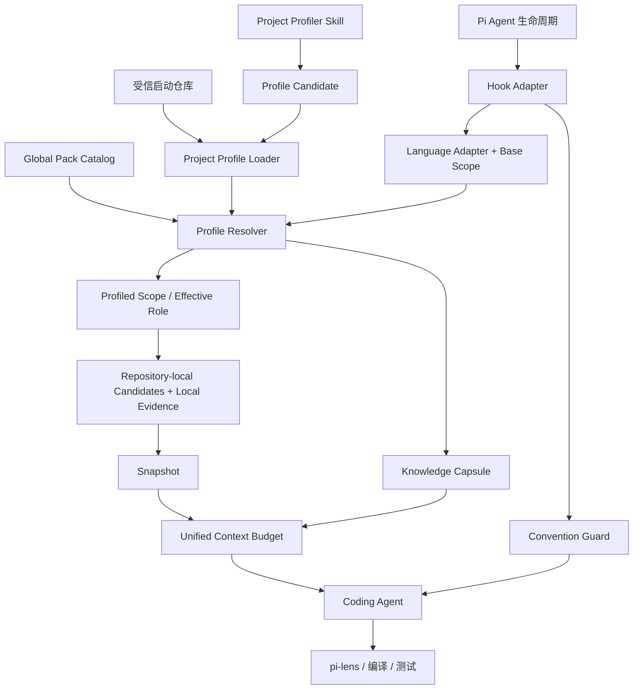
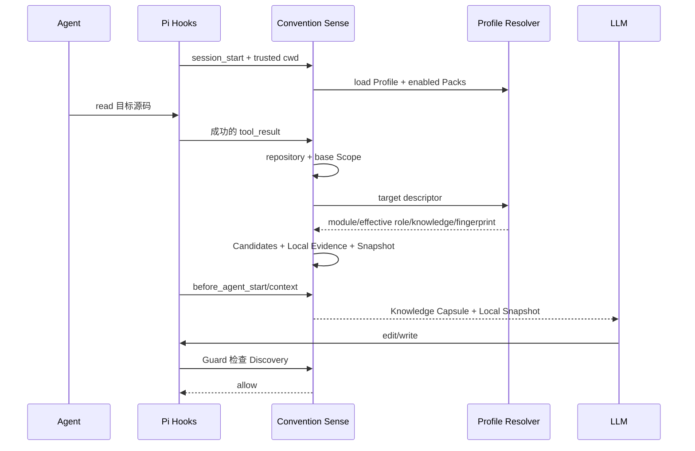

# pi-convention-sense V1 技术设计方案

> 文档状态：方案草案（Draft）
> 版本：V1.1
> 源文档标注更新日期：2026-09-17
> 当前架构融合日期：2026-09-23
> 对应需求文档：[requirements.md](./requirements.md)
> Project Intelligence 深入设计：[project-intelligence.md](./project-intelligence.md)

## 1. 设计概述

pi-convention-sense 采用 **Pi Extension 为核心、Skill 为辅助** 的实现方式。

Extension 负责：

- Pi 生命周期 Hook 接入；
- Java、TypeScript 与 Vue Scope 识别；
- repository/module/workspace 隔离的候选发现和排序；
- Evidence 与 Snapshot 构建；
- 受信 Project Profile 与 Global Pack 加载、解析和 fingerprint；
- effective role、Knowledge Capsule 与 Local Evidence 的统一预算注入；
- edit/write 前 Guard；
- Session、Branch、Freshness 和运行时账本管理；
- 可选后置审计。

Project Profiler Skill 只承担用户显式触发的 Profile `init/adopt/refresh/diff` 流程，不作为正常编码链路的强依赖。它使用当前 Agent 生成 candidate，必须经过 validate、semantic diff 和显式批准，不能静默覆盖 active Profile。

V1.1 的正常运行链路采用确定性本地分析，不引入第二个 LLM，不自动重构，也不根据单次观察修改 `AGENTS.md` 或 Project Profile。可版本控制的长期项目知识只通过显式 Profile 生命周期建立。

## 2. 可行性与 Pi API 边界

### 2.1 所需能力映射

| 需求能力 | Pi 能力 | 设计结论 |
| --- | --- | --- |
| 自动生效 | `before_agent_start` | 注入少量稳定行为原则 |
| 稳定行为约束 | `promptGuidelines` / sections | 避免整体替换 System Prompt |
| 每次模型调用前动态注入 | `context` | Snapshot 的主要注入点 |
| 跟踪已完成读取 | `tool_result` | 只记录成功结果 |
| 修改前检查和阻止 | `tool_call` | 可 block 当前调用，但不能暂停后原地恢复 |
| 任务结束检查 | `agent_settled` | 用于可选后置审计 |
| Discovery/诊断能力 | `registerTool()` | 可注册自定义工具 |
| 扩展状态持久化 | `appendEntry()` / SessionManager | V1 先用内存，V1.1 再持久化 |

### 2.2 必须遵守的边界

- `tool_call` 触发时，模型已经生成了工具调用。Guard 可以阻止当前 edit，但不能让模型在同一次 edit 中先补读代码再无缝继续。
- 同一 Assistant Message 可能包含并行工具调用。同批 read 尚未返回时，edit preflight 不得把它们视为已完成读取。
- edit/write 可以可靠拦截；Shell、PowerShell 和第三方工具直接修改文件时只能通过后置检测补足。
- Pi Session 是分支结构，Snapshot 和账本必须按 Branch 隔离，不能直接使用跨 Branch 的全局 Map。
- 频繁重写完整 System Prompt 可能降低 Prompt cache 命中率；稳定原则放 guideline，动态证据放 `context`。

## 3. 总体架构



### 3.1 组件职责

| 组件 | 职责 | 明确不负责 |
| --- | --- | --- |
| Hook Adapter | 订阅生命周期、标准化工具事件、触发内部服务 | 不推断具体惯例 |
| Language Adapter / Scope Detector | 识别 Java、TypeScript、Vue 的 base role、module/workspace 和 confidence | 不把一个样本升级为规则 |
| Project Profile Loader | 在受信启动仓库加载、校验并 fingerprint active Profile | 不自动读取任意外部仓库 Profile |
| Pack Catalog / Profile Resolver | 解析 module、effective role、技术栈、knowledge 和 convention | Global Pack 不产生硬阻断 |
| Candidate Finder / Ranker | 在目标 Git repository 内按 base/effective role 选择 2～4 个 peer | 不跨 related project 取候选 |
| Evidence Builder | 提取确定性结构信号，计算支持率、反例和置信度 | 不输出绝对规范 |
| Snapshot Cache | 按 repository/Scope/Branch 缓存临时证据并校验 freshness | 不保存长期项目知识 |
| Capsule Formatter / Context Injector | 在统一 token 预算内注入目标相关知识和局部证据 | 不注入完整 Profile 或源码正文 |
| Convention Guard | edit/write 前校验 Discovery 是否充分 | 不因 Profile/Pack/风格差异阻断 |
| Post-change Auditor | 发现绕过前置 Guard 的变更和重大证据缺口 | 不自动重构 |
| Project Profiler Skill | candidate-first 地创建和刷新可审核 Profile | 不进入每轮编码链路，不调用第二个模型 |

### 3.2 设计原则

- 主路径是 Proactive Discovery，Guard 只兜底；
- 三层信息源为 Global Pack、Project Profile/Knowledge、Local Evidence；
- Global Pack 永远 advisory，draft Profile 中的 hard 项运行时降级为 advisory；
- Local Evidence 是当前 Scope 的代码事实，不自动回写 Profile；
- 一个 Git repository 对应一个 Profile，Profile trust 只属于 Pi 启动仓库；
- 先 Observe 收集数据，再开启 Guard；
- 用户要求和可执行检查始终高于项目知识与局部惯例；
- 默认 fail-open，分析异常不得破坏 Pi 主流程；
- 所有非平凡结论可回溯到 manifest、配置、源码、文档或用户审核证据。

## 4. 运行时流程

### 4.1 正常路径



处理步骤：

1. `session_start` 从 Pi 启动仓库加载受信配置和 `.convention-sense/profile.json`，校验 Profile 与 Pack 引用并计算 fingerprint。
2. Hook Adapter 只从成功的读取类 `tool_result` 中解析真实文件路径并写入 Read Ledger。
3. 目标路径解析自己的 Git repository root；Language Adapter 识别 language、module/workspace、base role 和 confidence。
4. Profile Resolver 仅在目标属于受信启动仓库时解析 matched module、effective role、architecture、tags、technology、knowledge 和 convention；外部仓库 Profile 状态为 `ignored`。
5. Candidate Finder/Ranker 在目标 repository 内按语言、base role、effective role 和模块/package 边界选出 Top K peer。
6. Language Adapter 提取结构信号，Evidence Builder 聚合 Observation。
7. Snapshot Cache 保存当前 Branch 下的 Snapshot，并把 Profile fingerprint 与 active Pack id/version 纳入 freshness。
8. 下一次 Context 在统一预算内注入目标相关 Knowledge Capsule 与 Local Snapshot，不注入完整 Profile。
9. edit/write 的 `tool_call` 由 Guard 校验 Discovery；条件满足则放行。

### 4.2 证据不足路径

1. Agent 发出 edit/write。
2. Guard 计算目标文件 Scope。
3. 检查 Snapshot、Read Ledger、Branch 和 freshness。
4. 若条件不足：
   - Observe：允许并记录 `wouldBlock`；
   - Guard：阻止当前调用，并返回原因、建议候选和补救动作。
5. Agent 下一轮完成读取后重新发起修改。

### 4.3 Shell/第三方工具路径

1. Hook Adapter 记录可疑命令或任务前后的仓库状态。
2. Mutation Ledger 或 Git diff 识别实际变更文件。
3. 对变更文件重新计算 Scope。
4. `agent_settled` 阶段检查是否存在有效 Evidence。
5. 输出证据缺口或重大偏离，不承诺撤销或阻止已经发生的变更。

### 4.4 `before_agent_start` 稳定原则

建议只注入：

```text
When modifying existing code:
- Prefer repeated conventions demonstrated by nearby relevant production code.
- Inspect equivalent implementations before introducing a new local pattern.
- Treat inferred conventions as preferences, not absolute rules.
- Explicit instructions and executable checks take precedence.
- Avoid unrelated refactors made only to enforce stylistic consistency.
```

## 5. 核心数据模型

### 5.1 Scope

```typescript
interface ConventionScope {
  language: "java" | "typescript" | "vue";
  module: string;
  role: string;                 // base role
  effectiveRole?: string;       // Profile/Pack refinement
  architecture?: string[];
  profileTags?: string[];
  profileFingerprint?: string;
  root: string;
  sourceRoot?: string;
  packageName?: string;
  confidence: "high" | "medium" | "low";
}
```

`scopeKey()` 使用 `effectiveRole ?? role`，但候选初筛仍先保持 base role 兼容，再隔离 effective role。Snapshot 同时记录 `repositoryRoot`，运行时状态按 Session Branch 隔离，避免跨仓库、跨 subtype 或跨 Branch 串用。

### 5.2 Evidence 和 Observation

```typescript
interface EvidenceRef {
  path: string;
  mtimeMs: number;
  contentHash?: string;
  score: number;
}

interface ConventionObservation {
  id: string;
  category: string;
  pattern: string;
  support: number;
  samples: number;
  confidence: "high" | "medium" | "low";
  evidence: EvidenceRef[];
  counterEvidence: EvidenceRef[];
}
```

Mixed 不必成为类型字段；实现可将其表示为低/中置信 Observation 组，或增加 `status: "dominant" | "mixed"`。无论采用哪种表示，都不得进入 Guard 的风格硬判断。

### 5.3 Snapshot

```typescript
interface ConventionSnapshot {
  scope: ConventionScope;
  repositoryRoot: string;
  targetPath: string;
  targetKind: "existing" | "prospective";
  targetMtimeMs: number;
  targetSize: number;
  targetHash: string;
  observations: ConventionObservation[];
  evidenceFiles: EvidenceRef[];
  candidates: RankedCandidate[];
  projectContext?: ResolvedProjectContext;
  createdAt: number;
  status: "valid" | "weak" | "stale";
  staleReason?: string;
  tokenEstimate: number;
  analyzerVersion: string;
  configFingerprint: string;
}
```

`configFingerprint` 同时覆盖运行配置、Profile fingerprint 和 active Pack id/version。`projectContext` 保存解析结果而不是完整 Profile；格式化时只选择当前目标相关的 knowledge/convention。

### 5.4 运行时状态

```typescript
interface RuntimeState {
  branchId?: string;
  reads: Map<string, ReadRecord>;
  mutations: MutationRecord[];
  snapshots: Map<ScopeKey, ConventionSnapshot>;
  pendingTargets: Set<string>;
}
```

实际实现中 `snapshots` 的键应包含仓库和 Branch，或由 Branch 级 RuntimeState 隔离。

## 6. Scope Detector 设计

### 6.1 Java 角色识别

| 主信号 | Role | 补充信号 |
| --- | --- | --- |
| `*Controller.java` | controller | `@Controller` / `@RestController` |
| `*Service.java` | service-interface | interface、package |
| `*ServiceImpl.java` | service-impl | `@Service`、implements |
| `*Mapper.java` | mapper | `@Mapper`、接口继承 |
| `*Repository.java` | repository | `@Repository` |
| `*Req.java` / `*Request.java` | request-dto | package、校验注解 |
| `*Resp.java` / `*Response.java` / `*VO.java` | response-dto | package、序列化注解 |
| `*Entity.java` 或 `@Entity` | entity | ORM 注解、继承关系 |

建议先用低成本文件名/路径判断，再在需要时读取有限源码信号提高置信度。

TypeScript/Vue Adapter 已覆盖：

- route page；
- shared、route-local 与 layout-local component；
- hook/composable；
- API service 与 request client；
- Pinia store；
- router；
- layout；
- workspace package。

Profile/Pack refinement 在 base Scope 之后执行。例如 Java `controller` 可细分为 `mvc-view-controller` 与 `rest-controller`，Vue `page` 可细分为项目特有的 `vue-page`。Selector 只能使用 path、language、module、base role、file name、annotation 和 dependency 等声明式白名单字段。

### 6.2 模块识别优先级

1. 最近的模块构建文件或配置边界；
2. Java package 与源码根；
3. 常见业务模块目录；
4. 当前文件父级路径；
5. 无法可靠识别时退化为 repository-level，并降低置信度。

模块识别策略应封装为可替换组件，以便在 Spike 后决定 Maven/Gradle 边界和业务目录的优先顺序。

## 7. Candidate Discovery 与排序

### 7.1 搜索层级

- Level 0：同目录 + 同 Role；
- Level 1：同模块 + 同 Role；
- Level 2：邻近模块 + 同 Role；
- Level 3：仓库级同 Role。

找到足够候选后停止扩张，避免无意义全仓扫描。候选不足 `minEvidenceFiles` 时仍可生成 weak Snapshot。

### 7.2 过滤规则

- 候选必须位于目标 Git repository，related project 只可作为 metadata；
- 扩展名/语言与 base role 必须兼容；
- Profile 生效后，候选必须与目标 effective role 兼容；
- workspace 项目默认限制在同 package；
- 排除目标文件本身；
- 默认排除 generated、build、target、vendor、test fixture；
- 默认 production code 优先；
- 排除配置命中的路径；
- 识别 deprecated/generated 信号并降权；
- 最终 Evidence 默认使用 2～4 个候选；effective role 深分析使用有界初筛预算。

### 7.3 评分模型

```text
score =
  30 * sameRole
+ 25 * sameModule
+ 15 * samePackageOrSibling
+ 10 * annotationSimilarity
+  8 * interfaceOrSuperclassSimilarity
+  7 * importJaccard
+  3 * recentlyMaintained
+  2 * sizeSimilarity
- 20 * generatedOrDeprecated
- 15 * testOnly
```

各项归一化到 0～1。Ranker 输出：

- 总分；
- 各评分项明细；
- 搜索层级；
- 被排除或降权的原因。

Observe 日志保存评分解释，便于人工评估候选认可率。

### 7.4 性能策略

- 使用仓库文件索引，避免每轮递归扫描；
- Scope/候选结果按目录状态缓存；
- 仅在目标 Scope 首次出现或 freshness 失效后重算；
- 昂贵信号（import、annotation、继承）只对初筛后的有限候选计算。

## 8. Evidence Builder 设计

### 8.1 语言适配器接口

建议定义统一接口：

```typescript
interface LanguageAdapter {
  supports(path: string): boolean;
  detectRole(input: SourceInput): RoleDetection;
  extractSignals(input: SourceInput): DeterministicSignal[];
}
```

V1 包含：

- `generic.ts`：扩展名、目录、文件名等通用能力；
- `java.ts`：Java 角色和确定性结构信号；
- `adapter.ts`：接口和注册表。

### 8.2 Java 首版信号

- 构造器注入、字段注入、Setter 注入；
- 类/接口/方法注解集合；
- `@Transactional` 所在层级和方法类型；
- 异常类型、错误码容器；
- 日志框架、占位参数方式、业务标识；
- DTO/VO/Req/Resp 命名；
- 返回包装类型；
- converter/mapper 调用；
- null/Optional 处理；
- 方法可见性、`@Override`、命名结构；
- Controller→Service、Service→Mapper/Repository 依赖形态。

实现优先使用轻量解析或可靠 token/AST 能力。若首版使用正则，必须限制在明确结构信号，不对复杂语义作结论。

### 8.3 聚合与置信度

对每个 category/pattern 聚合：

```text
supportRate = support / samples
```

推荐规则：

- High：`samples >= 3 && supportRate >= 0.8 && scope.confidence == high`；
- Medium：`samples >= 2 && supportRate >= 0.6`；
- Low：其他情况；
- Mixed：存在多个接近的主要分支，或主导比例不足。

Evidence Builder 必须保留 counterEvidence，不允许只展示支持样本。

## 9. Context Injector 设计

### 9.1 注入格式

Context 由两个相互独立、共享预算的块组成：

1. `<project-knowledge>`：Profile Resolver 为当前目标选择的 module、effective role、technology、architecture、knowledge 与 convention；
2. `<local-convention>`：当前 Scope 的真实 peer 与重复 Observation。

Draft Profile 明确标记为 advisory；完整 Profile、源码正文和未匹配知识均不进入 Context。

```xml
<project-knowledge profile=".convention-sense/profile.json" review="draft">
Matched modules: server-web
Effective role: rest-controller
Knowledge:
- [advisory/project-profile] Controller boundary: ...
</project-knowledge>

<local-convention scope="java:order:service-impl" confidence="high">
Target:
- OrderServiceImpl.java

Comparable implementations:
- UserServiceImpl.java
- PaymentServiceImpl.java
- DeviceServiceImpl.java

Repeated observations:
- constructor injection: 3/3
- BizException + ErrorCode: 3/3
- @Transactional on mutation methods: 2/3
- parameterized SLF4J logging: 3/3

Mixed:
- method decomposition varies

Instruction:
Use this as local consistency evidence, not an absolute rule.
Do not refactor unrelated code solely to match these observations.
</local-convention>
```

### 9.2 Snapshot 选择

- 只注入与当前任务、最近读取或待修改目标相关的 Snapshot；
- 多 Scope 活跃时，按待修改目标、最近访问、Scope 置信度和 Token 预算排序；
- 不默认复制 Evidence 完整源码，只给路径、比例和关键观察；
- 同一 Snapshot 未变化时复用格式化结果，避免重复计算。

### 9.3 Token 裁剪

默认 `maxContextTokens = 1200`，裁剪顺序：

1. 删除 Low Observation；
2. 删除或压缩 Mixed 细节，但保留“存在混合”的提醒；
3. 减少候选路径；
4. 压缩说明性文本；
5. 保留优先级声明、Target、High/Medium Observation 和关键反例。

不得通过硬截断破坏 XML/结构或关键指令。

## 10. Convention Guard 设计

### 10.1 判定流程

```text
resolve target path
  -> detect target kind (existing/new)
  -> detect scope
  -> load branch-local snapshot
  -> validate freshness
  -> validate evidence threshold / no-peer decision
  -> validate recent context injection
  -> apply mode and bypass policy
  -> allow | wouldBlock | block
```

### 10.2 判定结果

建议统一返回：

```typescript
interface GuardDecision {
  action: "allow" | "wouldBlock" | "block";
  reasonCode: string;
  message: string;
  targetPath: string;
  scope?: ConventionScope;
  suggestedPeers?: string[];
  bypassAvailable: boolean;
}
```

reasonCode 示例：

- `TARGET_NOT_READ`；
- `SCOPE_UNKNOWN`；
- `SNAPSHOT_MISSING`；
- `SNAPSHOT_STALE`；
- `INSUFFICIENT_EVIDENCE`；
- `SNAPSHOT_NOT_INJECTED`；
- `NO_PEERS_AVAILABLE`；
- `BYPASS_GRANTED`。

### 10.3 新文件

1. 根据路径和文件名推断 Scope；
2. 搜索同 Role peer；
3. 建立 Snapshot 后允许 write；
4. 若无 peer，记录 `NO_PEERS_AVAILABLE` 并降级，不永久阻塞。

### 10.4 Guard 边界

- Guard 只保证受控 edit/write 工具的 preflight；
- 不对 Low/Mixed 风格差异硬阻止；
- 分析异常默认 fail-open 并记录；
- bypass 必须可观测，避免静默绕过；
- Guard 错误信息必须能指导 Agent 下一轮自行补救。

## 11. Session、Branch、缓存与 Freshness

### 11.1 V1 状态策略

- Extension 启动或 Session start 时初始化内存状态；
- Branch/fork/change 事件发生时清空重建，或切换到 Branch 独立状态；
- 不跨仓库复用；
- 不保存长期惯例；
- Snapshot 以 Scope + repository + Branch 为隔离边界。

### 11.2 Freshness 校验

注入或 Guard 前校验：

- 目标文件和 Evidence 文件是否仍存在；
- `mtime` 是否变化；
- 可选 content hash 是否变化；
- Branch 状态是否一致；
- 配置 fingerprint 是否一致；
- Profile fingerprint 是否一致；
- active Pack id/version 是否一致；
- 分析器版本是否一致。

任一关键条件变化后：

1. 标记 Snapshot 为 `stale`；
2. 不再注入或用于 Guard 放行；
3. 按需重新 Discovery；
4. 记录失效原因。

### 11.3 V1.1 持久化

可通过：

```typescript
appendEntry("convention-snapshot", snapshot)
```

保存扩展数据。此数据不直接进入 LLM Context；恢复时必须根据当前 Session Branch 重建或筛选状态。

## 12. 配置设计

路径：`.pi/convention-sense.json`

```json
{
  "enabled": true,
  "mode": "observe",
  "minEvidenceFiles": 2,
  "maxEvidenceFiles": 4,
  "maxContextTokens": 1200,
  "scopeStrategy": "module-role",
  "includeLanguages": ["java"],
  "exclude": [
    "**/generated/**",
    "**/build/**",
    "**/target/**",
    "**/vendor/**",
    "**/node_modules/**"
  ],
  "injectContext": true,
  "persistSessionState": true,
  "logPath": ".pi/convention-sense/observe.ndjson",
  "guard": {
    "pathExceptions": [],
    "allowBypass": true,
    "requireRecentContext": true,
    "contextWindowTurns": 2,
    "contextMaxAgeMs": 600000
  },
  "postChangeAudit": {
    "enabled": true,
    "notify": true,
    "maxChangedFiles": 100
  },
  "toolMappings": [],
  "logging": {
    "level": "info",
    "explainRanking": true
  }
}
```

约束：配置只控制系统行为，不允许堆叠“Controller 必须怎样写”等编码规则。

Project Profile 固定使用启动仓库下的 `.convention-sense/profile.json`，不通过运行配置指向任意外部路径。Profile 缺失、无效、未信任或目标位于外部仓库时 fail-open 到 base role 与 Local Evidence。Global Pack 只有被受信 Profile 显式启用后才生效，并且始终 advisory。

配置加载建议：

- 提供默认值和 schema 校验；
- 非法配置输出诊断并回退安全默认值；
- 配置变化使相关 Snapshot 失效；
- V1 默认 `mode = observe`、Guard 关闭、fail-open。

## 13. 项目结构

当前主要结构：

```text
pi-convention-sense/
├── package.json
├── extensions/
│   └── index.ts                  # Pi 生命周期编排
├── src/
│   ├── observe/
│   │   ├── analyzer.ts
│   │   ├── candidate-ranker.ts
│   │   ├── evidence-builder.ts
│   │   ├── java-analyzer.ts
│   │   ├── observe-decision.ts
│   │   ├── repository-index.ts
│   │   ├── scope-detector.ts
│   │   ├── snapshot-cache.ts
│   │   ├── snapshot-formatter.ts
│   │   └── types.ts
│   ├── guard/
│   │   ├── convention-guard.ts
│   │   ├── git-auditor.ts
│   │   ├── post-change-audit.ts
│   │   ├── runtime.ts
│   │   └── tool-mapping.ts
│   ├── profile/                  # Pack、Profile、Selector、Resolver 与 Capsule
│   └── runtime/                  # 配置、Context、状态、日志和 Pi 生命周期基础设施
│       ├── config.ts
│       ├── context.ts
│       ├── guard.ts
│       ├── logger.ts
│       ├── paths.ts
│       ├── state.ts
│       ├── status.ts
│       └── types.ts
├── examples/
│   ├── config/
│   │   ├── java-observe.json
│   │   ├── java-guard.json
│   │   └── typescript-vue-observe.json
│   └── legacy/
│       └── stage-0-spike.json
└── test/
    ├── fixtures/
    ├── core.test.ts
    ├── observe.test.ts
    ├── guard.test.ts
    └── extension.test.ts
```

正式 Guard 已作为显式 opt-in 实现；辅助 Skill 仍保留给后续深度审计阶段，不进入正常编码链路。

## 14. 与 Pi 生态组件的集成

| 组件 | 原有职责 | 集成方式 |
| --- | --- | --- |
| `AGENTS.md` | 架构、安全、依赖、流程硬约束 | 优先级高于 Local Convention；本项目只读取，不自动修改 |
| agent-md-management | 长期维护 `AGENTS.md` | 与会话内局部证据分工 |
| pi-lens | LSP、format、lint、type、结构和影响诊断 | 承担机器可验证层，避免重复实现和重复拦截 |
| pi-conventions | 文件位置、命名、依赖边界等显式策略 | 可作为未来 Hard Architecture Policy，不是 V1 核心依赖 |
| pi-simplify / Reviewer | 修改后审查与简化 | 可消费 Snapshot，但不能演变为通用“代码洁癖”评审 |

## 15. 异常和降级设计

| 场景 | 处理 |
| --- | --- |
| 无足够候选 | 生成 weak Snapshot，明确“证据不足” |
| Scope 冲突 | 选择保守 Scope 或标记混合，降低置信度 |
| 分析器异常 | 记录错误，默认 fail-open，不中断 Pi 主流程 |
| 超大仓库 | 文件索引、目录限制、缓存，禁止每轮全仓遍历 |
| 并行工具 | 成功 `tool_result` 返回后才写入 Read Ledger |
| 文件删除/重命名 | Snapshot stale，触发重新发现 |
| Shell 修改 | Mutation Ledger/Git diff 标记 `post-check required` |
| 用户要求采用新模式 | 用户需求优先，记录有意偏离，禁止顺手改无关代码 |
| test/production 冲突 | production code 默认优先，分开计算 |
| generated code | 默认排除，显式配置后才纳入 |

## 16. 可观测性

Observe 模式至少记录：

- 事件类型和标准化工具名；
- 目标文件和识别出的 Scope；
- 候选列表、评分和各项解释；
- Observation 的样本、支持率、反例和置信度；
- Snapshot 的生成、命中、失效和重建；
- Context 注入的 Scope、Token 估算和裁剪情况；
- Guard 的 `allow / wouldBlock / block`、reasonCode 和 bypass；
- Shell 后置检测和审计缺口。

日志不得无控制地复制完整源码。

## 17. 测试方案

### 17.1 单元测试

- Scope Detector：文件名、路径、注解、package、implements 的组合；
- Candidate Finder/Ranker：搜索层级、同 Role/模块排序、排除规则、Tie-break；
- Evidence Builder：一致、混合、低样本、反例场景；
- Confidence：阈值边界；
- Snapshot Cache：命中、过期、配置变化和 Branch 隔离；
- Formatter：Token 预算、Low/Mixed 裁剪和结构完整性；
- Guard：Observe、Guard、bypass、新文件、弱证据、fail-open。

### 17.2 集成测试

- read → 成功 `tool_result` → Snapshot → `context` → edit allow；
- 未读同类代码直接 edit → Observe `wouldBlock`；
- Guard block → 补读 peer → 下一轮放行；
- sibling tool calls 并行时不把未完成 read 计入；
- Evidence 文件变化后 Snapshot stale；
- Branch A/B 切换不串用状态；
- Shell 修改后 `agent_settled` 审计发现缺口；
- 与 pi-lens 同时启用时无重复拦截或死循环。

### 17.3 Fixture 仓库

至少准备：

1. 风格高度一致的 Java 模块；
2. 构造注入/字段注入混杂模块；
3. 无同类实现的新模块；
4. 多模块同名角色仓库；
5. generated/test 文件较多的仓库；
6. 包含 `AGENTS.md` 和子目录覆盖规则的仓库。

### 17.4 性能和质量门槛

- Top-K 候选人工认可率 ≥ 80%；
- 高置信 Observation 准确率 ≥ 90%；
- Observe 潜在误拦截率 ≤ 10%；
- 平均 Snapshot ≤ 1200 tokens；
- 首次分析增加的交互延迟可接受；
- 每轮不得全量扫描仓库；
- Branch 串用 Snapshot 数量为 0。

## 18. 实施计划

### 阶段 0：技术 Spike

实现最小事件日志 Extension，验证：

- Pi 事件 payload 和工具名映射；
- `context` 注入行为；
- `tool_call` block 行为；
- 并行工具处理；
- Session/Branch 生命周期；
- `agent_settled` 行为。

退出条件：目标 Pi 版本的实际行为与设计假设一致，或已形成兼容层方案。

### 阶段 1：V1 Observe

实现：

- Java Scope Detector；
- Candidate Finder/Ranker；
- 确定性 Evidence Builder；
- Snapshot Context 注入；
- Read/Mutation Ledger；
- Observe 日志与指标；
- 内存 Cache 和 Branch 失效。

退出条件：在真实企业项目完成至少 20～30 个任务评估，候选和 Observation 指标达标。

### 阶段 2：V1 Guard

实现：

- edit/write Guard；
- 可操作的缺 Evidence 提示；
- bypass 与 fail-open；
- pi-lens 联调；
- Shell 变更后置检查。

退出条件：误拦截率可接受，且不会造成工作流死循环。

### 阶段 3：V1.1 Project Intelligence（已实现）

- v3 Session checkpoint、Branch 精确恢复和 `/convention-reset confirm`；
- Project Profile trust gate、schema、fingerprint、module 与 effective role；
- Global Pack catalog，且强制 advisory；
- Knowledge Capsule 与 Local Snapshot 统一预算；
- Project Profiler Skill 的 candidate → diff → approve → adopt 流程；
- TypeScript/Vue Adapter 与 workspace package 隔离；
- SnailJob 后端与前端全栈真实验证。

### 阶段 4：后续产品化与扩展

- 更多真实开源仓库和跨项目兼容矩阵；
- 更多语言/框架 Adapter 与可组合 Pack；
- Pi 新版本兼容验证、CI 和发布自动化；
- 在不调用第二个模型的前提下评估 AST、Git 历史和语义信号；
- Guard 继续保持 experimental opt-in，达到真实准入门槛前不默认启用。

## 19. 已确定的设计决策

- 使用 Pi Extension，而非纯 Skill；
- Proactive Discovery 为主，Guard 兜底；
- Snapshot 通过 `context` 临时注入，不写入 `AGENTS.md`；
- V1 使用确定性分析，不调用第二个 LLM；
- 局部惯例以 Evidence 表达，不生成绝对规则；
- Cache Key 至少包含 language、module、effective/base role、仓库和 Branch 语义；
- Java、TypeScript 与 Vue 使用独立确定性 Adapter；
- Global Pack → Project Profile/Knowledge → Local Evidence 构成三层信息源；
- 一仓库一 Profile，Profile trust 只按 Pi 启动仓库加载；
- base role 保持跨项目兼容，effective role 隔离项目 subtype；
- Profile/Pack fingerprint 参与 Snapshot freshness；
- 完整 Profile 不注入，只生成目标相关 Knowledge Capsule；
- Profile 更新必须 candidate-first，并经显式批准；
- 默认先 Observe，真实评估后再 Guard；
- pi-lens 负责机器可验证问题；
- Shell 修改主要通过后置检测处理；
- 配置文件只控制行为，项目知识写入声明式 Profile。

## 20. 技术待确认项与 Spike 结论

### 20.1 阶段 0 历史基线已确认

- 阶段 0 的验证目标为 Pi `0.85.1`、Node.js `>=22.19.0`；
- 当时内置工具采用 `read/edit/write/bash/powershell` 及其 0.85.1 payload；
- 成功 read 只在 `tool_result` 入账，同批 pending read 不满足 Guard；
- `context` 可注入不持久化的 custom message；
- `tool_call` 可真实阻止 edit/write，阻止后文件保持不变；
- Session resume 可从 active-branch custom entry 恢复状态；
- 真实 TUI `/tree` 切换已验证 `session_tree` 会按目标 branch checkpoint 重建状态；
- Pi 没有供本设计直接使用的稳定 branch UUID，状态以 Session active path 重建；
- `agent_settled` 在自动后续动作结束后触发，适合作为审计时机；
- 默认采用 Observe + fail-open；
- 诊断入口采用 `/convention-status`。

详见 [stage-0-spike.md](./stage-0-spike.md)。

### 20.2 阶段 1 已确认

- Java V1 支持 Maven/Gradle 最近构建边界，并对根构建仓库使用业务 package fallback；
- Java 信号解析采用注释/字符串安全的词法清洗和有边界结构规则；
- 候选搜索采用仓库索引、低成本初筛和 Top 20 深分析；
- 最终 Evidence 只使用 2～4 个 peer，目标文件、test 和 generated 默认不参与生产证据；
- Evidence samples 按 category 可观察文件计数，并保留 counterEvidence 和 Mixed；
- Snapshot freshness 校验 mtime、size、SHA-256、配置 fingerprint 和分析器版本；
- Snapshot 留在内存，Ledger v2 checkpoint 保存 `recentReads`，分支切换后重建；
- Context 使用结构化裁剪并遵守默认 1200-token 预算；
- Observe 缺失/弱 Snapshot 只记录 `wouldBlock`，不阻止 edit/write；
- 第三方工具映射推迟到阶段 2；
- Shell 后置检测倾向 Git diff 基线，不采用常驻 watcher。

详见 [stage-1-observe.md](./stage-1-observe.md)。

### 20.3 阶段 2 已确认

- Guard 只阻断缺少 Discovery 流程，不阻断 Low/Mixed 风格差异；
- 现有目标要求成功 read、fresh Snapshot 和最近实际 Context 注入；
- weak/no-peer/insufficient-peer、低 Scope 和分析异常 fail-open；
- 新文件使用 prospective Snapshot，有有效 Evidence 时先注入再 write，无 peer 时直接放行；
- 单次 bypass 绑定精确路径、只消费一次、不跨 Session/Branch；
- 项目例外使用 `guard.pathExceptions` glob；
- 第三方工具使用显式 `toolName + operation + pathField` 映射，内置工具不可覆盖；
- Shell 使用执行前 Git baseline、dirty 文件 fingerprint、执行后状态和 HEAD diff，不使用 watcher；
- post-change Evidence gap 注入下一轮 Context，并在 `agent_settled` 汇总。

详见 [stage-2-guard.md](./stage-2-guard.md)。

### 20.4 阶段 3 已确认

- Project Profile 仅在受信启动仓库加载，外部仓库 Profile 状态为 `ignored`；
- Profile schema/root/selector 使用声明式白名单校验，并计算稳定 fingerprint；
- 未审核 Profile 保持 `draft`，其中 hard 项运行时降级为 advisory；
- Global Pack 仅作为 advisory baseline，必须由受信 Profile 显式启用；
- base role 可由 module/annotation/path selector 细分为 effective role；
- Profile、Pack id/version 与配置共同参与 Snapshot freshness；
- Knowledge Capsule 只选择当前目标相关条目并与 Local Snapshot 共享预算；
- Project Profiler 不调用第二个模型，active Profile 只能经 candidate、validate、diff 和显式批准更新；
- TypeScript/Vue Adapter 已覆盖 page、component、hook、API、request、store、router、layout 和 workspace package；
- SnailJob 后端/前端真实流程验证了 Profile + Pack + Local Evidence、repository/workspace 隔离与 Guard 主路径。

详见 [project-intelligence.md](./project-intelligence.md)。

### 20.5 Pi 0.87.1 兼容性已确认

- 当前开发依赖、类型检查和自动测试基于 Pi `0.87.1`；
- 按 Pi package 官方规范，`peerDependencies` 使用 `"*"`，但兼容声明只依据验证矩阵，不把 `*` 解释为全版本支持；
- `context`、`session_start`、`session_tree`、`tool_call`、`tool_result`、`agent_settled` 和 `appendEntry()` 等既有 API 在 0.87.1 中继续可用；
- 稳定指导改为由 `before_agent_start` 更新 normalized `systemPromptOptions.sections["pi-convention-sense"]`，不再返回完整 `systemPrompt`；
- 动态 Snapshot 与 Knowledge Capsule 继续通过非持久化 custom `context` message 注入；
- 独立 `--no-session` Pi 0.87.1 子进程已验证 `session_start → before_agent_start → context → agent_settled → session_shutdown`；
- 0.87.1 下 strict TypeScript、clean build 和 56 个自动测试全部通过。

详见 [compatibility.md](./compatibility.md)。

### 20.6 Guard 生产准入仍需确认

- 20～30 个更多真实任务中的 Top-K 认可率、Observation 准确率和潜在误拦截率；
- 是否因真实误判升级完整 Java parser；
- 与 pi-lens 同时安装后的重复拦截和死循环测试；
- HEAD 变化、复杂 rename 和超大 dirty worktree 的真实项目表现；
- Guard 是否只作为 opt-in，或具备更广泛启用条件。

## 21. 参考资料

- [Pi Extensions 官方文档](https://pi.dev/docs/latest/extensions)
- [Pi Session Format 官方文档](https://pi.dev/docs/latest/session-format)
- [Pi Settings 官方文档](https://pi.dev/docs/latest/settings)
- [Pi Quickstart 与 AGENTS.md](https://pi.dev/docs/latest/quickstart)
- [pi-lens](https://pi.dev/packages/pi-lens)
- [pi-conventions](https://pi.dev/packages/pi-conventions)
- [pi-simplify](https://pi.dev/packages/pi-simplify)
- [pi-subdir-context](https://pi.dev/packages/pi-subdir-context)

## 22. 推荐下一步

以当前 Java + TypeScript/Vue + Project Intelligence 闭环为基线，优先完成目标 Pi 新版本兼容验证、更多不同组织结构的真实仓库矩阵以及 pi-lens 组合验证。继续保持 Observe 默认和 Guard experimental opt-in；达到跨项目真实任务门槛后，再决定 Guard 是否具备更广泛启用条件。
